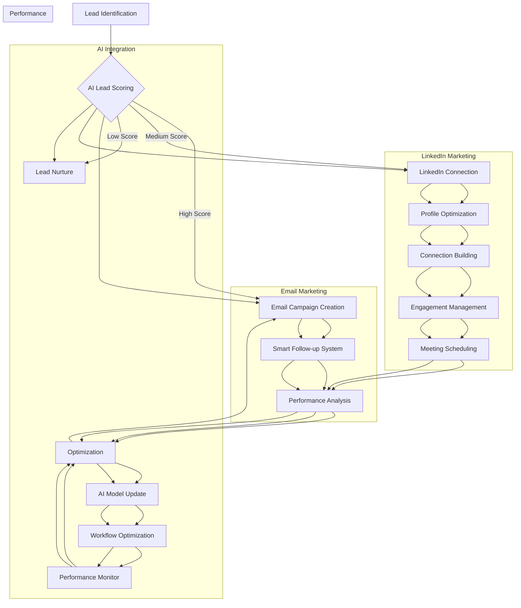

# AI Automation Workflow Diagram

## Workflow Components

### Email Marketing Flow
1. Lead Identification → AI Lead Scoring → Campaign Creation
2. Campaign Launch → Smart Follow-up System → Performance Analysis
3. Optimization Loop → AI Model Update → Workflow Adjustment

### LinkedIn Marketing Flow
1. Lead Identification → Profile Optimization
2. Connection Building → Engagement Management
3. Meeting Scheduling → Performance Analysis

### AI Integration Flow
1. Data Collection → AI Model Processing
2. Workflow Optimization → Performance Monitoring
3. Continuous Learning → System Updates
